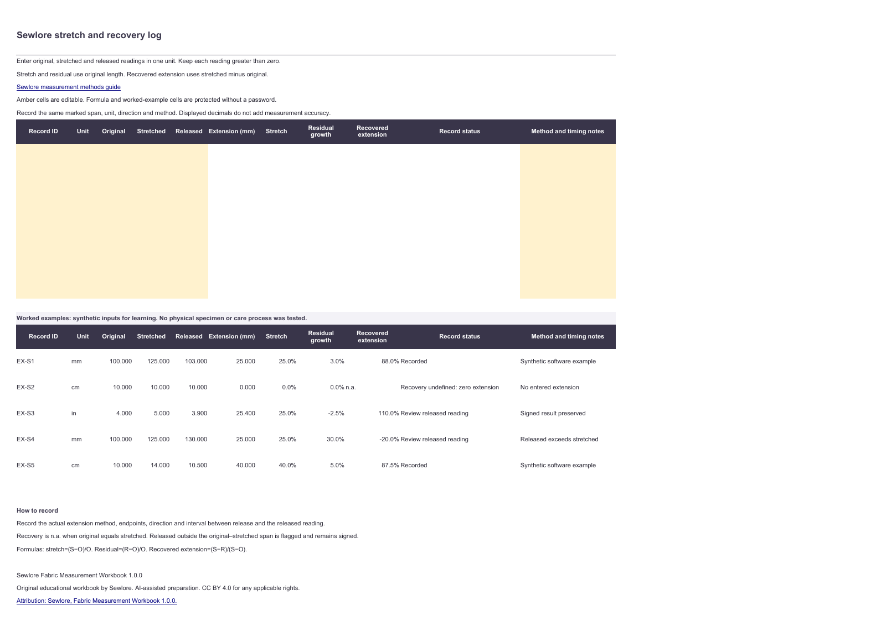

# Sewlore Fabric Measurement Workbook

A free offline LibreOffice Calc template for recording fabric stretch, recovery, paired care readings and length conversions. Version 1.0.0.

[Download the reusable template](sewlore-fabric-measurement-workbook-1.0.0.ots), [open the editable workbook](sewlore-fabric-measurement-workbook-1.0.0.ods), or [read the PDF overview](sewlore-fabric-measurement-workbook-1.0.0.pdf).

## Use the workbook

Open the `.ots` file in LibreOffice Calc to create a new copy, then save the copy as `.ods`. Amber cells accept your readings. Formula cells and tutorial examples are protected against accidental changes, without a password. There are 12 blank records in each workflow and five separately labelled synthetic examples beneath them.

- **Stretch and recovery:** enter original, stretched and released readings in one common unit. Record the actual extension method, direction, marked endpoints and release interval in the notes.
- **Paired care readings:** record before and after length and width from the same marked sample. Record the care process actually used. Select **Yes** for rectangular geometry only when that assumption describes your comparison.
- **Unit conversion:** select both units and enter a value. Zero is allowed for conversion. Keep the original reading and its supported resolution in your records.

Unit menus accept `cm`, `mm` and `in`. Numeric validation blocks nonpositive measurement readings, and formula guards also diagnose pasted invalid inputs. Missing readings do not appear as plausible zero results. To add rows, remove sheet protection, copy a complete blank row with formulas and validation, and restore protection.

## Understand the results

For original `O`, stretched `S` and released `R`, stretch is `(S - O) / O`; residual growth is `(R - O) / O`; recovered extension is `(S - R) / (S - O)`. Percent cells display these ratios as percentages. Recovered extension is `n.a.` when there is no entered extension. Released readings outside the original-to-stretched span are flagged and the signed results remain visible.

For before `B` and after `A`, signed contraction is `(B - A) / B`. A positive result means contraction and a negative result means expansion. Rectangular area contraction is `1 - (after length / before length) * (after width / before width)`. It is not the sum of the two side percentages. Nonrectangular comparisons retain side results and omit area.

Exact conversion factors are 10 mm per cm and 25.4 mm per inch. Display rounding does not change stored values or add measurement accuracy.

These comparisons describe the readings entered. They cannot predict future dimensional change, prescribe care instructions, establish garment fit or demonstrate compliance with a laboratory procedure. The PDF is a digital A3 landscape overview. It is not a printer scaling test or an interactive PDF form.

## Source and verification

The calculation definitions and recording context are explained in the [Sewlore fabric measurement methods guide](https://sewlore.com/pages/fabric-measurement-methods-guide). Each worksheet links to this source.

The original workbook was prepared with AI assistance for Sewlore. Tutorial records are synthetic arithmetic examples; no specimen, care process or physical printer was tested for this release. Native files and fresh input changes were checked in LibreOffice 26.2.6.3, including blank versus zero, no entered extension, signed expansion, out-of-span released readings, unit conversions and the final blank row. The release contains no macros, remote data connections or telemetry.

The `.ods` and `.ots` files are editable document sources. `workbook-model.json` records the public cell definitions and formulas for inspection. `checksums.sha256` identifies the release files.

## License and attribution

Original educational content and document sources are offered under [CC BY 4.0](https://creativecommons.org/licenses/by/4.0/) for any applicable rights. Reuse and adaptations, including commercial reuse, are permitted under the license conditions. Keep appropriate credit, link the license and identify your changes. No exclusive human authorship or copyright protection is claimed for purely algorithmic material.

Suggested attribution: **Sewlore, Fabric Measurement Workbook 1.0.0**, with the [measurement methods guide](https://sewlore.com/pages/fabric-measurement-methods-guide) and [CC BY 4.0](https://creativecommons.org/licenses/by/4.0/) links. Your adaptation does not imply Sewlore endorsement.
