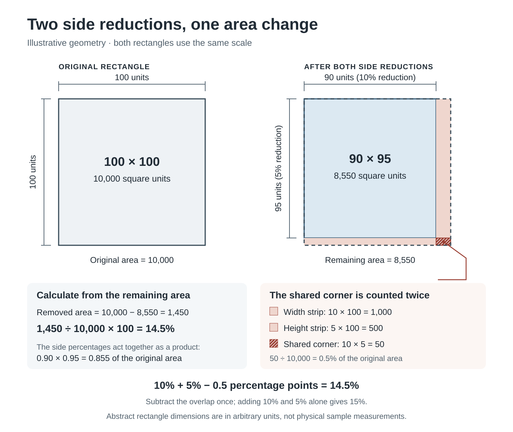

# Recording and Validating Fabric Dimensions

## An educational methods guide to stretch, recovery and paired care readings

**Prepared for Sewlore (Organization) · Educational note, revision 1 - 6 October 2026**  
**Document type:** technical educational guide and software documentation; not a peer-reviewed research paper.

### Abstract

Percentage calculations become useful only when their inputs and denominators are clear. This guide separates three questions: how far a marked span extends, how much of that extension is recovered after release, and how paired dimensions change after a recorded care process. It defines signed results, explains why two side percentages cannot simply be added to obtain an area change, and describes the input checks in Fabric-Care CSV Validator version 1.0.0. Worked values and CSV records are explicitly hypothetical software examples. No fabric specimens were tested to produce this guide. The versioned software source, its DOI and its archived directory identify a reproducible calculation implementation; they do not certify a measurement procedure, establish garment fit or confer peer review.

**Keywords:** measurement records; CSV validation; dimensional change; percentage arithmetic; educational software; reproducibility.

## 1. Define the comparison before calculating

A length without a method description is difficult to interpret. In a private working record, identify the sample, the marked endpoints, the direction called length or width, the unit and the condition in which the reading was taken. Record the care process actually used, its relevant settings, the number of cycles and when the sample was measured afterward. For a stretch comparison, also record the extension method, the endpoint used, and the interval between release and the released reading. Do not invent a universal force, rest period or care setting from the arithmetic below.

Compare the same marked span and direction before and after. Replacing one sample with another or measuring between different endpoints changes the question being asked. Keep information about changes in preparation or measurement conditions alongside the record rather than attributing a result to an unobserved cause. Fabric or garment care instructions should come from the manufacturer or the applicable care label; the software's care codes are descriptions, not recommendations.

Standardized textile procedures exist. ISO 5077:2007 addresses dimensional change under specified washing and drying procedures [6]. AATCC TM135-2025 addresses length and width changes after home laundering [7]. Their public descriptions establish that procedural conditions matter; this guide does not reproduce their full methods or claim compliance with either standard. Its purpose is narrower: transparent record keeping, elementary calculations and software input validation.

The [Sewlore stretch and recovery guide][stretch-guide] provides practical recording context. A separate [pre-cutting recording guide][recording-guide] discusses retaining sample and project context. Neither is cited here as evidence of a laboratory experiment.

## 2. Stretch and recovery use different denominators

Let `O` be the original marked length, `S` the stretched length and `R` the length recorded after release. All three readings must be positive and finite, in one consistent unit. The Sewlore sewing-tools implementation also requires `S ≥ O` [5]. Define extension as `E = S − O`.

The three outputs answer different questions:

| Output | Formula | Denominator and interpretation |
| --- | --- | --- |
| Stretch percentage | `(S − O) / O × 100` | Extension relative to the original length. |
| Residual growth percentage | `(R − O) / O × 100` | Released-length difference relative to the original length. A negative result means the entered released length is shorter. |
| Recovered extension percentage | `(S − R) / (S − O) × 100` | The fraction of the extension that has been recovered by the recorded release reading. |

**Hypothetical example A:** `O = 100 mm`, `S = 125 mm`, `R = 103 mm`. Extension is 25 mm. Stretch is 25%; residual growth is 3%; recovered extension is `22 / 25 × 100 = 88%`. The residual 3% and the recovered 88% are not complementary percentages: they use different denominators.

If `S = O`, there was zero entered extension. Recovered extension is undefined because its denominator is zero. The implementation returns no numeric recovery value; it does not replace an undefined fraction with 0% or 100%. Original, stretched and released readings of 100 mm therefore give 0% stretch, 0% residual growth, and an undefined recovered-extension percentage.

The implementation flags a released reading below `O` or above `S` for review and preserves the calculated sign. For example, the **hypothetical** triple `100, 125, 97 mm` gives −3% residual growth and 112% recovered extension. This flag invites checking the record and method; it does not diagnose a material mechanism. No result is silently clamped to a preferred 0–100% interval.

These stretch calculations are in the separate sewing-tools source [5]. Fabric-Care CSV Validator v1.0.0 calculates paired care changes, not stretch or recovery. This distinction prevents a formula described in this guide from being mistaken for a feature of the archived CSV application.

## 3. Care readings use a signed contraction convention

For a before reading `B` and an after reading `A`, define signed contraction percentage as:

`C = (B − A) / B × 100 = (1 − A / B) × 100`

In the validator, a positive result denotes contraction, a negative result denotes expansion, and zero denotes unchanged entered dimensions [1]. This is the opposite sign to the common growth expression `(A − B) / B × 100`. State which convention is used whenever results leave the application.

**Hypothetical example B:** 20 cm before and 19 cm after gives +5% contraction. Changing the after reading to 21 cm gives −5%, meaning expansion under this convention. These numbers demonstrate arithmetic; no care process was performed for them.

Use the original before dimension as the denominator. Dividing the 1 cm difference by 19 cm instead answers a different question. Percentages also depend on the chosen baseline: changes across successive cycles should name their baseline instead of implying that a cycle-to-cycle percentage is a cumulative percentage from the original reading.

Units cancel in a ratio only when the compared readings describe the same unit. The validator accepts `cm`, `mm` and `in`, uses 10 mm per centimetre and 25.4 mm per inch, and converts internally to millimetres. Each CSV record must nevertheless have matching `before_unit` and `after_unit`. A physically equivalent mixed-unit pair is rejected until the readings are explicitly converted and recorded consistently. Different records may use different supported units.

## 4. Rectangular area is a product, not a sum

Let the paired dimensions be `L₀, W₀` before and `L₁, W₁` after. If both pairs describe flat rectangles, retained area fraction is:

`q = (L₁ / L₀) × (W₁ / W₀)`

Area contraction is `Carea = (1 − q) × 100`. If the signed side contractions are percentages `CL` and `CW`, the same identity is:

`Carea = CL + CW − CL × CW / 100`

**Hypothetical example C:** 20 × 20 cm becomes 19 × 19.5 cm. The side contractions are +5% and +2.5%. The retained area fraction is `0.95 × 0.975 = 0.92625`; area contraction is **7.375%**, not 7.5%.



**Figure 1. Illustrative abstract geometry, not a fabric specimen.** A 100 × 100 rectangle has area 10,000 arbitrary square units. After 10% and 5% side reductions, a 90 × 95 rectangle has area 8,550. The two removed strips have areas 1,000 and 500, but share a 50-unit corner. Subtracting the double count gives 1,450 removed units, or 14.5%. The overlap is 0.5% of the original area, so the additive 15% estimate is corrected by **0.5 percentage points**. The diagram is a programmatically generated, AI-assisted SVG; no human visual author is claimed. Its public Commons description records that provenance and the PD-algorithm and MIT licensing notices [8].

Mixed signs also matter. A **hypothetical** 100 × 100 rectangle becoming 110 × 95 gives −10% length contraction, +5% width contraction and **−4.5% area contraction**, meaning a 4.5% area expansion. Equal and opposite side percentages do not necessarily cancel: 105 × 95 retains 99.75% of a 100 × 100 area, a 0.25% contraction.

The validator omits area output unless `rectangle_assumption` is `yes`. Use that option only when the dimensions represent the relevant flat rectangles. Two spans on an irregular, curved, skewed or otherwise nonrectangular region are not sufficient to establish its actual area. The application does not estimate garment surface area from body measurements.

## 5. Preserve inputs and postpone rounding

Record a reading with its unit and the resolution supported by the measuring method. Extra calculator digits do not create extra measurement accuracy. Keep the original readings in the user's record; do not overwrite them with rounded ratios or percentages.

The validator uses Python floating-point arithmetic. Equivalent units preserve the mathematical percentage, but the final binary representation can differ in insignificant trailing digits. CSV numeric exports use `.12g`, or up to 12 significant digits; the interactive table's presentation is separate from this export format. The worked values above are given to enough places to show the arithmetic, not to claim that a physical measurement was accurate to three decimal places.

Extreme magnitudes can overflow or underflow even if an individual input looks like a number. Version 1.0.0 checks finite positive readings, supported unit conversions, positive finite axis ratios and representable optional area ratios. A numeric diagnostic means the record needs attention; it is not evidence that its fabric has an extreme property.

## 6. Validate a CSV before interpreting its rows

Use the header-only template supplied with the fixed source release [2]. Its ten columns, in order, are:

```csv
sample_id,before_unit,after_unit,before_length,before_width,after_length,after_width,care_method,rectangle_assumption,notes
```

The hosted application accepts UTF-8 CSV, optionally with a byte-order mark, up to **128 KiB** and **250 non-empty records**. Use anonymous identifiers such as `sample-101`: `sample-` followed by one to six digits. Four dimension readings must be positive finite decimal numbers. Do not include unit text or thousands separators inside numeric cells. Zero, negative values, missing readings, `NaN` and infinity are not valid dimensions.

The allowed care codes are `wash`, `dry`, `wash-and-dry`, `rinse`, `steam`, `press` and `other`. In real records, choose the code describing what was actually done. Keep detailed method information privately and leave the hosted `notes` column empty. Do not upload names, contact details, body measurements, personal identifiers or sensitive information.

For an arithmetic exercise only, save the header above followed by these **invented software records**. Their care labels do not document performed procedures:

```csv
sample-101,cm,cm,20,20,19,19.5,wash,yes,
sample-102,mm,mm,100,100,110,95,other,yes,
sample-103,cm,mm,20,20,190,195,wash,yes,
```

The first record should be accepted with +5%, +2.5% and +7.375%. The second should be accepted with −10%, +5% and −4.5%. The third should receive a units correction and should not be calculated. To compare its intended physical pair, the user must explicitly convert either the before or after readings and update the unit fields.

Open the [public validator][hosted-app], confirm the anonymous-record restriction, and submit using **Validate CSV**. Alternatively, run the fixed release locally. Malformed quoting, unsupported encoding and hosted policy or limit violations reject the submission before calculation. Numerical and column errors are diagnosed per record after the policy checks. Read the correction download as well as the accepted-record download; a partly accepted file is not a clean bill of health for its rejected rows. Correct the source records, retain a trace of the change, and validate again.

The code quotes exported CSV cells and neutralizes formula-like free text. Genuine negative numeric percentages remain numbers. This precaution does not justify uploading private notes or skipping a review of the spreadsheet import settings.

## 7. Reproduce the software, not an unperformed experiment

The published source is **Fabric-Care CSV Validator | Sewlore, version 1.0.0**, released on 6 October 2026 [1–3]. Its Git source revision is `1db7b9a4fc8da8a109d6b40e125387752583c8bb`; the Software Heritage directory identifier is `swh:1:dir:b795a703838b14c1d4b6e49538a303c07f3e27b3` [4]. These identifiers describe the software archive. This guide has no assigned DOI, and the software DOI must not be presented as a DOI for this document.

Download the source archive from the versioned release or DOI record. The reviewed 15-file archive is named `sewlore-fabric-care-validator-v1.0.0-source.zip`, is 17,744 bytes, and has SHA-256:

`0e3c0e6e6701812f3a07b5f15cddc26929ee6a76e2550fd4e5e7314312402bbe`

Use Python 3.12 and the pinned `streamlit==1.65.0` dependency. The release README contains environment setup instructions. After extracting and activating a local environment, the documented commands are:

```sh
python -m pip install --index-url https://pypi.org/simple -r requirements.txt
python -m streamlit run app.py --server.address 127.0.0.1 --server.port 8502 --server.headless true
```

Open `http://localhost:8502/` in the browser and stop the server with Ctrl+C when finished. The release's software checks can be run with:

```sh
python -B -m unittest discover -s tests -v
```

The ten release checks concern upload policy and application flow. Their fixtures and this guide's examples are synthetic software inputs; they are not material test observations. Reproducing their expected outputs establishes a software check, not independent validation of a physical care or stretch protocol.

For a reproducibility record, retain the source revision, Python and dependency versions, input header and units, rectangle choice, input and output file hashes where appropriate, and any presentation rounding. The hosted demonstration and repository `main` may change after the fixed release. Later DOI citation metadata on `main` does not alter the archived v1.0.0 source.

## 8. Privacy, attribution and interpretation limits

The hosted CSV application sends submitted data to a Streamlit server and processes it in memory. Its source does not save submitted CSV to disk, cache it across users, send it to external APIs, add application analytics or print it to logs. Temporary session state supports downloads. Hosting-platform requests and usage statistics are outside the application's control; Community Cloud currently forces its own usage-statistics setting. Local use avoids submitting sample records to the hosted application, but users remain responsible for their own environment and records [2].

Sewlore is the organization credited for the software and this guide's preparation. Development and documentation were AI-assisted using OpenAI Codex, with source review and worked arithmetic checks. No personal researcher identity, academic affiliation, credential, funding, peer review or laboratory study is claimed. The software carries the MIT license; Figure 1's source and explanation are also distributed under MIT for any applicable copyright [5]. The original educational text and document source are distributed under the MIT license for any applicable copyright, with the notice Copyright (c) 2026 Sewlore. No exclusive human visual authorship or copyright protection of purely algorithmic material is asserted.

A DOI and a source archive help identify a software version. They do not establish experimental accuracy, recommended fabric care, certification, garment fit, or whether search engines index a record. The value of the calculation is its explicit relationship to the recorded inputs and conditions.

## References and supporting material

1. Sewlore. (2026). *Fabric-Care CSV Validator | Sewlore* (Version 1.0.0) [Computer software]. [https://doi.org/10.5281/zenodo.23193335](https://doi.org/10.5281/zenodo.23193335). Version-specific software DOI, not a guide DOI.
2. Sewlore. *Version 1.0.0 source release and included README*. [GitHub release](https://github.com/gokimedia/sewlore-fabric-care-validator/releases/tag/v1.0.0). The source includes `validator.py`, `input_policy.py`, the blank template, hypothetical fixtures, tests and `LICENSE.txt`.
3. Zenodo. *Fabric-Care CSV Validator | Sewlore*. [Published Software record](https://zenodo.org/records/23193335). This is a software deposit, not a research paper or measurement dataset.
4. Software Heritage. *Archived validator source directory*. [Directory permalink](https://archive.softwareheritage.org/swh:1:dir:b795a703838b14c1d4b6e49538a303c07f3e27b3). Directory identifier corresponds to the recorded release source; the ordinary GitHub release is not described as immutable.
5. Sewlore. *Sewing-tools calculation source and rectangular-area diagram*. [Calculation source](https://github.com/gokimedia/sewlore-sewing-tools/blob/e4450fd9f79df53501a13fe8c8d9a422e8915148/calculations.js); [diagram source and licensing](https://github.com/gokimedia/sewlore-sewing-tools/blob/e4450fd9f79df53501a13fe8c8d9a422e8915148/resources/rectangular-area-two-axis-change-README.md). Figure 1 is separate from the validator v1.0.0 release.
6. International Organization for Standardization. *ISO 5077:2007 — Textiles: Determination of dimensional change in washing and drying*. [Official scope page](https://www.iso.org/standard/41877.html). Public abstract consulted 6 October 2026; the full procedure was not used as a test protocol for this guide.
7. AATCC. *TM135-2025: Dimensional Changes of Fabrics after Home Laundering*. [Official method listing and scope](https://members.aatcc.org/store/tm135/543/). Public scope consulted 6 October 2026; no conformity claim is made.
8. Wikimedia Commons. *Rectangular area change after two side reductions*. [Public SVG description, provenance and licensing](https://commons.wikimedia.org/wiki/File:Rectangular_area_change_after_two_side_reductions.svg). Programmatic AI-assisted illustration prepared for Sewlore; not a photograph or physical test result. The file's public uploader is not asserted to be a human visual author of the drawing or an author of this guide.

[stretch-guide]: https://sewlore.com/blogs/sewing-journal/measure-fabric-stretch-and-record-recovery
[recording-guide]: https://sewlore-preparation-notes.blogspot.com/2026/10/what-to-record-before-cutting-fabric.html
[hosted-app]: https://sewlore-fabric-care-validator.streamlit.app/
